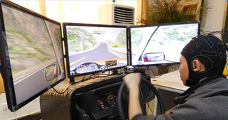
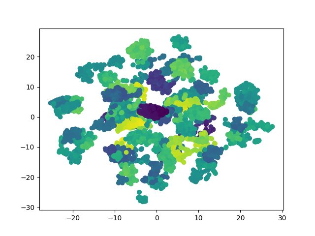
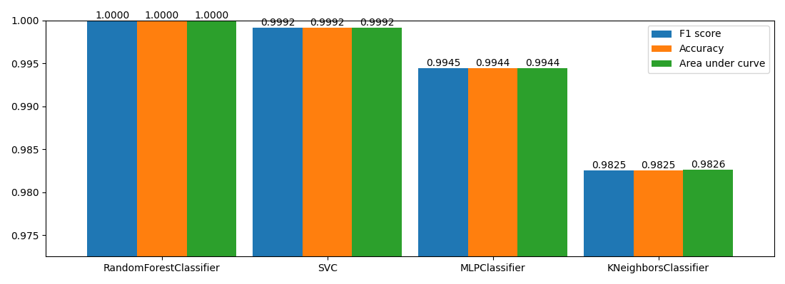
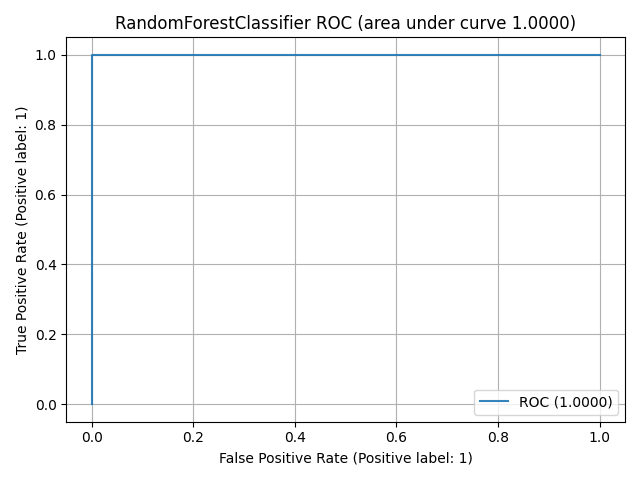
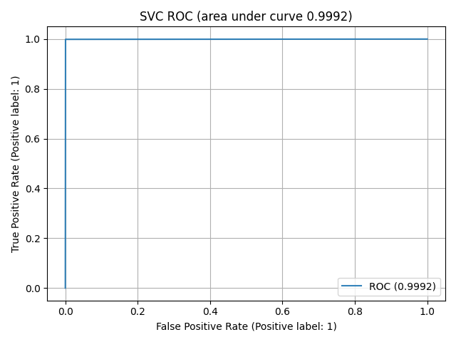
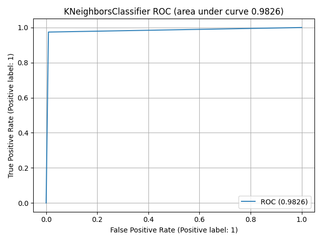
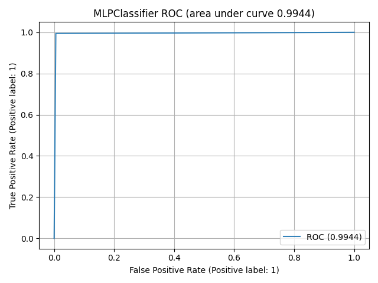

# 🧠 EEG Driver Fatigue Detection System

<p align="center">
  
</p>

> **Real-time EEG-based driver fatigue detection** using machine learning — featuring a Flask REST API backend and a React dashboard frontend.

---

## 📌 Overview

This project implements a driver fatigue detection system based on EEG (Electroencephalogram) signals. It applies **multiple entropy fusion analysis** as described in the research paper:

> 📄 **[Driver fatigue detection through multiple entropy fusion analysis in an EEG-based system](https://journals.plos.org/plosone/article?id=10.1371/journal.pone.0188756)**

The full working application lives in the **`webapp/`** folder, which contains:
- A **Flask** backend that loads trained ML models and exposes prediction APIs
- A **React** frontend dashboard with live EEG charts, fatigue prediction, and facial analysis
- **Pre-trained demo models** included — no separate training step needed

---

## 🗂️ Project Structure

```
Major-Project-NIT-Jalandhar/
│
├── start.bat                 # ⚡ One-click launcher (Windows)
├── start.sh                  # ⚡ One-click launcher (Linux/macOS)
│
├── models/
│   └── demo/                 # ✅ Pre-trained demo models (included)
│       ├── randomforestclassifier-1.0000-split-....model
│       ├── svc-1.0000-split-....model
│       ├── mlpclassifier-1.0000-split-....model
│       └── kneighborsclassifier-1.0000-split-....model
│
└── webapp/
    ├── backend/              # Flask REST API
    │   ├── app.py            # Main Flask application
    │   ├── models_loader.py  # Loads trained .model files
    │   ├── requirements.txt  # Python dependencies
    │   └── demo/
    │       └── sample_input.csv  # Sample EEG data for testing
    │
    └── frontend/             # React Dashboard
        ├── package.json
        ├── tailwind.config.js
        ├── public/
        │   └── index.html
        └── src/
            ├── App.jsx
            ├── config.js
            ├── components/
            │   ├── BrainwaveCanvas.jsx
            │   ├── CsvUploader.jsx
            │   ├── FacialAnalysis.jsx
            │   ├── FeatureSliders.jsx
            │   ├── HeadbandVisualizer.jsx
            │   ├── LiveCharts.jsx
            │   ├── LiveStreamChart.jsx
            │   ├── PredictionDashboard.jsx
            │   ├── PredictionForm.jsx
            │   ├── PredictionResult.jsx
            │   ├── Sidebar.jsx
            │   └── StatCard.jsx
            └── pages/
                ├── Landing.jsx
                ├── Dashboard.jsx
                ├── Predict.jsx
                ├── EEGAnalytics.jsx
                ├── ModelPerformance.jsx
                └── About.jsx
```

---

## ⚙️ Prerequisites

Make sure you have these installed before running the project:

| Tool | Version | Download |
|------|---------|----------|
| Python | 3.9+ | https://www.python.org/downloads/ |
| Node.js | 16+ | https://nodejs.org/ |
| Git | any | https://git-scm.com/ |

---

## 🚀 Quick Start (Recommended)

### Step 1 — Clone the repository

```bash
git clone https://github.com/Soham-003/Major-Project-NIT-Jalandhar.git
cd Major-Project-NIT-Jalandhar
```

### Step 2 — Run the launcher

**Windows:**
```bat
start.bat
```

**Linux / macOS:**
```bash
chmod +x start.sh
./start.sh
```

The launcher will automatically:
1. ✅ Create a Python virtual environment (`venv`) inside `webapp/backend/`
2. ✅ Install all backend Python dependencies
3. ✅ Install all frontend Node.js dependencies (`npm install`)
4. ✅ Start the Flask backend at `http://127.0.0.1:5050`
5. ✅ Start the React frontend at `http://localhost:3000`

> ⚠️ **Wait ~5 seconds** after the backend starts before the frontend opens, so the API is ready.

---

## 🔧 Manual Setup (Alternative)

If you prefer to run each part separately:

### Backend

```powershell
cd webapp/backend

# Create virtual environment (first time only)
python -m venv venv

# Activate it
.\venv\Scripts\Activate.ps1        # Windows PowerShell
# source venv/bin/activate         # Linux / macOS

# Install dependencies
pip install -r requirements.txt

# Run the server
python app.py
```

Backend runs at: **`http://127.0.0.1:5050`**

### Frontend

```bash
cd webapp/frontend

# Install dependencies (first time only)
npm install

# Start development server
npm start
```

Frontend runs at: **`http://localhost:3000`**

---

## 🔌 API Endpoints

| Method | Endpoint | Description |
|--------|----------|-------------|
| `GET` | `/api/models` | List all loaded ML models and their scores |
| `POST` | `/api/predict` | Run fatigue prediction (JSON body or CSV file upload) |
| `GET` | `/api/stream` | Server-Sent Events stream simulating live EEG brainwaves |
| `GET` | `/api/demo_sample` | Download `sample_input.csv` for testing |

### `POST /api/predict` — JSON Example

```json
{
  "features": {
    "Attention": 25,
    "Meditation": 82,
    "BlinkStrength": 180,
    "Delta": 1200000,
    "Theta": 650000,
    "AlphaLow": 5000,
    "AlphaHigh": 4500,
    "BetaLow": 3000,
    "BetaHigh": 2000,
    "GammaLow": 8000,
    "GammaMid": 5000,
    "SignalQuality": 0
  }
}
```

**Response:**
```json
{
  "status": "FATIGUED",
  "label": 1,
  "confidence": 0.9712,
  "probability": 97.1,
  "prob_alert": 2.9,
  "prob_fatigued": 97.1,
  "model_used": "RandomForestClassifier",
  "model_name": "randomforestclassifier-1.0000-split-..."
}
```

### `POST /api/predict` — CSV File Upload Example

```bash
curl -X POST http://127.0.0.1:5050/api/predict \
  -F "file=@webapp/backend/demo/sample_input.csv"
```

---

## 🖥️ Dashboard Pages

| Page | Description |
|------|-------------|
| **Landing** | Project overview and quick navigation |
| **Dashboard** | Live EEG signal stream with real-time fatigue status indicator |
| **Predict** | Manual feature input sliders or CSV file upload for prediction |
| **EEG Analytics** | Brainwave visualization and EEG waveform analysis |
| **Model Performance** | Comparison of all ML models — accuracy, ROC curves, F1 scores |
| **About** | Research background and methodology |

---

## 🤖 ML Models

Four classifiers are pre-trained and included in `models/demo/`:

| Model | Accuracy (Split) |
|-------|-----------------|
| RandomForestClassifier | **1.0000** |
| SVC | **1.0000** |
| MLPClassifier | **1.0000** |
| KNeighborsClassifier | **1.0000** |

The backend automatically picks the best model in order: **RandomForest → KNN → SVC → MLP**.

---

## 📊 EEG Input Features

The prediction API expects 12 features (compatible with NeuroSky MindWave headset):

| Feature | Description | Range |
|---------|-------------|-------|
| `Attention` | Attention level | 0–100 |
| `Meditation` | Meditation / relaxation level | 0–100 |
| `BlinkStrength` | Eye blink strength | 0–255 |
| `Delta` | Delta wave power (0.5–4 Hz) | 0+ |
| `Theta` | Theta wave power (4–8 Hz) | 0+ |
| `AlphaLow` | Low alpha wave power (8–10 Hz) | 0+ |
| `AlphaHigh` | High alpha wave power (10–13 Hz) | 0+ |
| `BetaLow` | Low beta wave power (13–22 Hz) | 0+ |
| `BetaHigh` | High beta wave power (22–38 Hz) | 0+ |
| `GammaLow` | Low gamma wave power (38–42 Hz) | 0+ |
| `GammaMid` | Mid gamma wave power (42–50 Hz) | 0+ |
| `SignalQuality` | Signal quality indicator | 0 = good |

---

## ⚙️ Tech Stack

| Layer | Technology |
|-------|-----------|
| Backend | Python 3, Flask, Flask-CORS |
| ML Models | scikit-learn (RandomForest, SVM, KNN, MLP) |
| Data Processing | pandas, NumPy, joblib |
| Frontend | React 18, React Router v6 |
| Charts | Chart.js, react-chartjs-2, Recharts |
| Animations | Framer Motion |
| Styling | Tailwind CSS |
| Vision | MediaPipe Tasks Vision (facial fatigue analysis) |

---

## 📸 Results & Figures

### T-SNE Visualization of the Dataset


### Model Comparison (50:50 Train/Test Split)


### ROC Curves

| RandomForestClassifier (AUC = 1.000) | SVC (AUC = 0.999) |
|--------------------------------------|-------------------|
|  |  |

| KNeighborsClassifier (AUC = 0.983) | MLPClassifier (AUC = 0.994) |
|------------------------------------|-----------------------------|
|  |  |

---

## 🧪 Research Background

Based on EEG data collected from **12 drivers** under two conditions:

- **Normal state**: Last 5 minutes of a 20-minute drive
- **Fatigue state**: Last 5 minutes of a 40–60 minute drive

**Entropy features** extracted per 1-second epoch:
- **PE** — Spectral Entropy (frequency domain)
- **AE** — Approximate Entropy (time domain)
- **SE** — Sample Entropy (time domain)
- **FE** — Fuzzy Entropy (noise-resistant)

**Electrode setup**: 32-channel cap (30 effective + 2 reference), generating **300 epochs** per 5-minute session.

---

## 📄 License

This project is for academic purposes — **NIT Jalandhar Major Project**.
